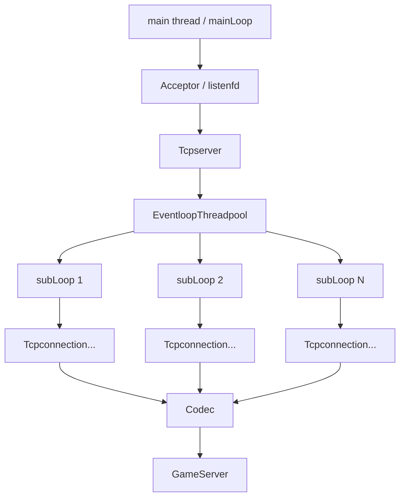

# Mini Muduo Reactor 学习项目

这是一个用于学习 Muduo 核心思想的 C++ Reactor 网络库项目，并在网络库之上实现了一个简单的双人匹配游戏服务器 Demo。

如果你刚开始接触 Muduo，可以把这个项目理解成一个“拆开来看”的学习版：它保留了 Reactor、`Channel`、`Eventloop`、`Tcpconnection`、线程池、长度头协议等核心概念，但代码规模更小，方便顺着调用链路理解。

## 项目目标

- 理解 Reactor 模式如何基于 `epoll` 分发 IO 事件。
- 理解 `Channel` 如何把 fd、事件和回调函数绑定起来。
- 理解 `one thread per loop` 在多线程网络库中的含义。
- 理解主从 Reactor：mainLoop 负责 `accept`，subLoop 负责连接读写。
- 理解 TCP 字节流如何通过 `Buffer + Codec` 拆成完整业务消息。

## 技术点

```text
C++17
Linux TCP
non-blocking IO
epoll
pthread
eventfd
Reactor
length-header codec
```

## 整体架构



核心分工：

```text
mainLoop
  负责监听 listenfd，接收新连接。

subLoop
  负责连接 connfd 的 read/write/close。

Tcpserver
  负责管理 Acceptor、线程池和连接表。

Tcpconnection
  负责单条 TCP 连接。

GameServer
  负责玩家、匹配、房间和消息转发。
```

## 目录结构

```text
Acceptor/              监听 socket，负责 accept 新连接
Buffer/                输入缓冲区
Channel/               fd、事件、回调的封装
Codec/                 4 字节长度头协议编解码
Epoller/               epoll_create / epoll_ctl / epoll_wait 封装
Eventloop/             Reactor 事件循环
EventloopThread/       一个线程中运行一个 Eventloop
EventloopThreadpool/   多个 subLoop 的线程池
Game-Server/           游戏业务：玩家、匹配、房间转发
Player/                玩家对象
Room/                  双人房间
Socket/                socket/bind/listen/accept 封装
Tcpconnection/         单条 TCP 连接
Tcpserver/             网络层总控
main/                  程序入口，注册业务回调
docs/                  详细链路说明
```

## 编译运行

```bash
make
./server
```

清理：

```bash
make clean
```

服务器默认监听：

```text
127.0.0.1:8080
```

## 协议格式

客户端发送的业务消息使用长度头协议：

```text
4 字节大端长度 + 消息体
```

例如消息体是：

```text
MATCH
```

则实际发送内容是：

```text
[4-byte length][MATCH]
```

这样可以处理 TCP 粘包和半包问题。

## 新手阅读路线

建议按下面顺序看代码：

1. `main/main.cpp`
2. `Tcpserver/Tcpserver.cpp`
3. `Acceptor/Accetpor.cpp`
4. `Channel/Channel.cpp`
5. `Eventloop/Eventloop.cpp`
6. `Epoller/Epoller.cpp`
7. `Tcpconnection/Tcpconnection.cpp`
8. `Codec/Codec.cpp`
9. `Game-Server/Game-Server.cpp`
10. `EventloopThread/` 和 `EventloopThreadpool/`

如果想直接看完整调用链路，可以阅读：

- [Reactor 调用链路详解](docs/reactor-flows.md)
-[Muduo学习书籍推荐](/Game-Server/Muduo-studying.md)
其中包含：

- 新连接到来时的链路
- 事件注册进内核的链路
- 事件从内核中被读取并处理的链路
- 跨线程任务投递链路
- 业务消息转发链路
- 连接关闭链路

## 学习重点

这个项目最重要的不是业务逻辑，而是网络库的骨架：

```text
fd -> Channel -> Eventloop -> Epoller -> callback
```

也可以概括成：

```text
把 fd 注册给 epoll
epoll_wait 等事件
事件回来后找到 Channel
Channel 调用绑定好的回调函数
业务逻辑通过回调被触发
```

这就是 Reactor 模式在本项目中的核心。

